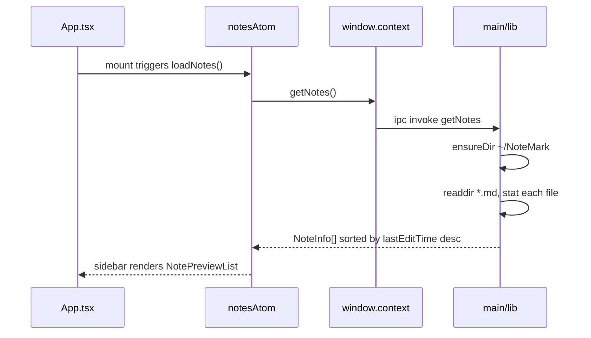
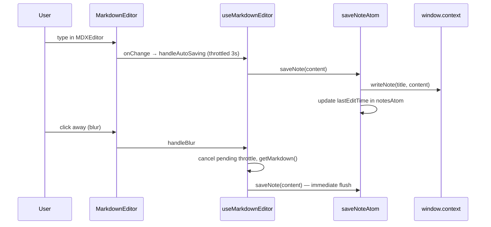
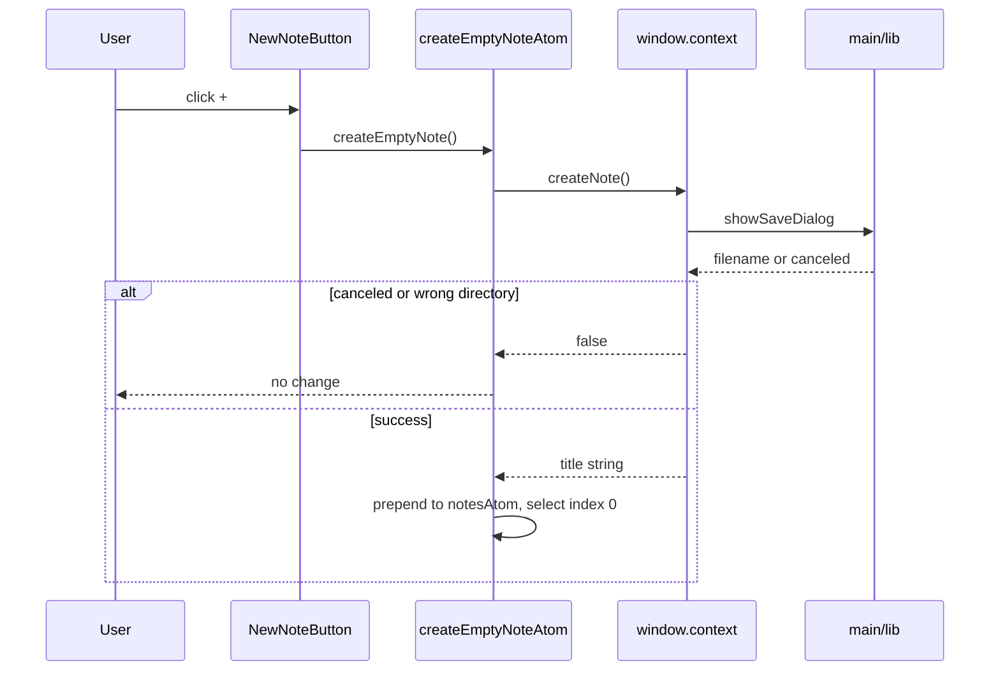
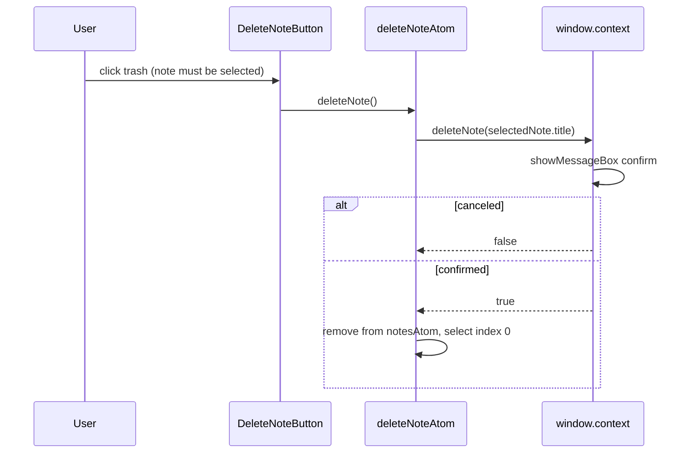

# Developer Guide

This document explains how NoteMark is built, how data flows through the app, and how to add new features. It is written for contributors who need to touch the main process, preload bridge, shared types, or React UI.

For end-user instructions (creating notes, editing, deleting), see [README.md](./README.md).

---

## Table of contents

1. [Build system](#build-system)
2. [Project layout](#project-layout)
3. [Process model](#process-model)
4. [Application flow](#application-flow)
5. [Data model and storage](#data-model-and-storage)
6. [State management](#state-management)
7. [Adding a feature](#adding-a-feature)
8. [Conventions](#conventions)

---

## Build system

The app uses [electron-vite](https://electron-vite.org/) to bundle three separate entry points from one repo:

| Entry | Source | Output | Runs in |
|-------|--------|--------|---------|
| **main** | `src/main/index.ts` | `out/main/` | Node.js (Electron main process) |
| **preload** | `src/preload/index.ts` | `out/preload/` | Isolated bridge script |
| **renderer** | `src/renderer/src/main.tsx` | `out/renderer/` | Chromium (React UI) |

Configuration lives in `electron.vite.config.ts`. Path aliases are defined there for Vite and mirrored in `tsconfig.node.json` (main/preload) and `tsconfig.web.json` (renderer).

### Commands

```bash
npm run dev          # Start all three bundles with HMR
npm run build        # Type-check + production build
npm run build:win    # Build + Windows installer (electron-builder)
npm run typecheck    # tsc for main and renderer separately
```

In development, the main window loads the renderer from a Vite dev server URL. In production it loads the built `index.html` from disk.

---

## Project layout

```
note-app/
├── src/
│   ├── main/                  # Electron main process
│   │   ├── index.ts           # App lifecycle, window, IPC registration
│   │   └── lib/
│   │       └── index.ts       # File I/O and native dialogs
│   │
│   ├── preload/
│   │   ├── index.ts           # contextBridge — exposes window.context
│   │   └── index.d.ts         # TypeScript types for window.context
│   │
│   ├── renderer/src/          # React application
│   │   ├── App.tsx            # Root layout composition
│   │   ├── main.tsx           # React entry point
│   │   ├── components/        # UI components
│   │   ├── hooks/             # Component-level logic
│   │   ├── store/             # Jotai atoms (app state + actions)
│   │   └── utils/             # Formatting helpers
│   │
│   └── shared/                # Code shared across processes
│       ├── models.ts          # Domain types (NoteInfo, NoteContent)
│       ├── types.ts           # IPC function signatures
│       └── constants.ts       # appDirectory, fileEncoding, autoSavingTime
│
├── electron.vite.config.ts
├── electron-builder.yml       # Packaging config
└── package.json
```

**Rule of thumb:** anything that touches the file system or OS dialogs belongs in `src/main/lib`. The renderer never imports Node modules directly — it always goes through `window.context`.

---

## Process model

Electron splits the app into isolated processes for security. The renderer runs in a sandbox with no direct Node.js access.

```
┌──────────────────────────────────────────────────────────────────┐
│                        RENDERER PROCESS                          │
│  React components → hooks → Jotai store                          │
│                              │                                   │
│                    window.context.method()                       │
└──────────────────────────────┼───────────────────────────────────┘
                               │
┌──────────────────────────────┼───────────────────────────────────┐
│                        PRELOAD SCRIPT                            │
│  contextBridge.exposeInMainWorld('context', { ... })             │
│  ipcRenderer.invoke('channelName', ...args)                      │
└──────────────────────────────┼───────────────────────────────────┘
                               │ IPC
┌──────────────────────────────┼───────────────────────────────────┐
│                        MAIN PROCESS                              │
│  ipcMain.handle('channelName', handler)                          │
│  src/main/lib — fs-extra, dialog, path                           │
└──────────────────────────────┼───────────────────────────────────┘
                               │
                               ▼
                      ~/NoteMark/*.md
```

### Security settings

The main window is created with `contextIsolation: true` and `sandbox: true` in `src/main/index.ts`. The preload script validates context isolation on load and throws if it is disabled.

### Current IPC surface

Each capability follows the same four-layer pattern:

| Layer | File | Responsibility |
|-------|------|----------------|
| Implementation | `src/main/lib/index.ts` | Business logic |
| Registration | `src/main/index.ts` | `ipcMain.handle('channel', ...)` |
| Bridge | `src/preload/index.ts` | `ipcRenderer.invoke('channel', ...)` |
| Types | `src/shared/types.ts` + `src/preload/index.d.ts` | Typed signatures on `window.context` |

Existing channels:

| Channel | Signature | What it does |
|---------|-----------|--------------|
| `getNotes` | `() => Promise<NoteInfo[]>` | List `.md` files with title + mtime |
| `readNote` | `(title) => Promise<string>` | Read file contents |
| `writeNote` | `(title, content) => Promise<void>` | Overwrite file contents |
| `createNote` | `() => Promise<string \| false>` | Save dialog → create empty file |
| `deleteNote` | `(title) => Promise<boolean>` | Confirm dialog → delete file |

---

## Application flow

### Startup



1. `App.tsx` mounts and renders `NotePreviewList`, which reads `notesAtom`.
2. `notesAtom` is an async atom that calls `window.context.getNotes()` on first access.
3. The main process ensures `~/NoteMark` exists, reads all `.md` files, and returns `{ title, lastEditTime }` for each.
4. Notes are sorted newest-first before being stored.

No note is selected on startup (`selectedNoteIndexAtom` defaults to `null`). The editor shows a placeholder until the user picks a note.

### Selecting a note

```mermaid
sequenceDiagram
    participant User
    participant List as NotePreviewList
    participant Index as selectedNoteIndexAtom
    participant Note as selectedNoteAtom
    participant IPC as window.context

    User->>List: click note at index N
    List->>Index: setSelectedNoteIndex(N)
    Index->>Note: recompute selectedNoteAtom
    Note->>IPC: readNote(notes[N].title)
    IPC-->>Note: markdown string
    Note-->>User: MarkdownEditor renders with content
```

- `useNotesList` hook wires click handlers to `selectedNoteIndexAtom`.
- `selectedNoteAtom` is a derived async atom: it looks up the note at the current index and fetches its content via `readNote`.
- `MarkdownEditor` uses `key={selectedNote.title}` so the editor remounts cleanly when switching notes.
- `App.tsx` passes `onSelect={resetScroll}` to scroll the editor panel back to the top.

### Editing a note



- Auto-save is throttled with lodash `throttle` using `autoSavingTime` (3000 ms) from `src/shared/constants.ts`.
- `leading: false, trailing: true` means the save fires once after typing stops, not on the first keystroke.
- Blur cancels any pending throttle and saves immediately.

### Creating a note



The main process enforces that new files must be created inside `~/NoteMark`. Choosing another folder shows an error dialog and returns `false`.

### Deleting a note



---

## Data model and storage

### Types (`src/shared/models.ts`)

```typescript
type NoteInfo = {
  title: string        // filename without .md extension
  lastEditTime: number // file mtime in milliseconds
}

type NoteContent = {
  content: string
}
```

In practice, `readNote` returns a raw `string` and `writeNote` accepts a raw `string`. The `NoteContent` wrapper type exists but is not used consistently yet — new code should align with whichever shape you standardize on.

### File naming

- **Title = filename stem.** A note titled `My ideas` is stored as `My ideas.md`.
- There is no separate metadata file. Title and path are the same thing.
- `lastEditTime` comes from the filesystem `mtime`, updated whenever `writeNote` saves content.

### Storage root

Defined in `src/shared/constants.ts`:

```typescript
export const appDirectory = "NoteMark"
```

Resolved at runtime as `homedir() + separator + appDirectory` in `src/main/lib/index.ts`.

---

## State management

The renderer uses [Jotai](https://jotai.org/) with async atoms and `unwrap` from `jotai/utils`.

### Atoms (`src/renderer/src/store/index.ts`)

| Atom | Kind | Purpose |
|------|------|---------|
| `notesAtom` | async (read) | Full note list, loaded once at startup |
| `selectedNoteIndexAtom` | sync (read/write) | Which sidebar item is active (`null` = none) |
| `selectedNoteAtom` | async (derived) | Selected note metadata + loaded content |
| `createEmptyNoteAtom` | write-only action | Create note via IPC, update list, select it |
| `deleteNoteAtom` | write-only action | Delete note via IPC, update list, reselect |
| `saveNoteAtom` | write-only action | Write content via IPC, bump `lastEditTime` |

### Patterns to follow

**Read state in components:**

```typescript
const notes = useAtomValue(notesAtom)
const saveNote = useSetAtom(saveNoteAtom)
```

**Write-only action atoms** use the `(null, async (get, set, ...args) => {})` form. They read current state with `get`, perform IPC calls, then update other atoms with `set`.

**Async atoms** return `Promise<T>` and are wrapped with `unwrap(..., fallback)` so components receive `T | undefined` instead of a Promise.

**Optimistic updates:** the store updates local state only after IPC confirms success (`createNote` returns a title, `deleteNote` returns `true`). Failed or canceled operations leave state unchanged.

---

## Adding a feature

Most features touch all four layers. Work bottom-up: shared types → main implementation → preload bridge → store/UI.

### Step-by-step checklist

```
1. Define the contract     src/shared/types.ts
2. Implement logic         src/main/lib/index.ts
3. Register IPC handler    src/main/index.ts
4. Expose on bridge        src/preload/index.ts
5. Add window type         src/preload/index.d.ts
6. Add store action/atom   src/renderer/src/store/index.ts  (if needed)
7. Add hook                src/renderer/src/hooks/            (if logic is non-trivial)
8. Add/update component    src/renderer/src/components/
9. Wire into App.tsx       (if it is a new top-level section)
10. Export from barrel     src/renderer/src/components/index.ts
```

### Example walkthrough: rename note title

This illustrates the full pipeline. Title is currently the filename, so renaming means renaming the file on disk.

**1. Shared type** — add to `src/shared/types.ts`:

```typescript
export type RenameNote = (
  oldTitle: NoteInfo['title'],
  newTitle: NoteInfo['title']
) => Promise<boolean>
```

**2. Main implementation** — add to `src/main/lib/index.ts`:

```typescript
export const renameNote: RenameNote = async (oldTitle, newTitle) => {
  const rootDir = getRootDir()
  const oldPath = `${rootDir}${separator()}${oldTitle}.md`
  const newPath = `${rootDir}${separator()}${newTitle}.md`

  // validate: new title non-empty, target doesn't exist, old file exists
  // optionally show a native dialog on conflict

  await rename(oldPath, newPath)  // fs-extra rename or move
  return true
}
```

**3. Register handler** — in `src/main/index.ts`:

```typescript
ipcMain.handle('renameNote', (_, ...args: Parameters<RenameNote>) => renameNote(...args))
```

**4. Preload bridge** — in `src/preload/index.ts`:

```typescript
renameNote: (...args: Parameters<RenameNote>) => ipcRenderer.invoke('renameNote', ...args)
```

**5. Window type** — in `src/preload/index.d.ts`, add `renameNote: RenameNote` to the `context` interface.

**6. Store action** — in `src/renderer/src/store/index.ts`:

```typescript
export const renameNoteAtom = atom(null, async (get, set, newTitle: string) => {
  const notes = get(notesAtom)
  const selectedNote = get(selectedNoteAtom)
  if (!selectedNote || !notes) return

  const success = await window.context.renameNote(selectedNote.title, newTitle)
  if (!success) return

  set(notesAtom, notes.map(n =>
    n.title === selectedNote.title ? { ...n, title: newTitle } : n
  ))
  // selectedNoteAtom will reload content under the new title on next read
})
```

**7. UI** — make `FloatingNoteTitle` editable on click: local input state, call `renameNoteAtom` on Enter/blur, handle validation errors inline.

**8. Edge cases to consider:**

- What if the user renames to a title that already exists?
- Should `selectedNoteIndexAtom` stay the same (yes — index doesn't change, only title)?
- Does `MarkdownEditor`'s `key={selectedNote.title}` remount correctly after rename? (It should, which resets editor state — verify this is acceptable or switch key strategy.)

This same checklist applies to any feature: export/import, search, tags, settings panel, etc.

### Features that stay renderer-only

Not everything needs IPC. You can add these without touching the main process:

- **UI/layout changes** — new panels, collapsible sidebar, animations
- **Client-side filtering/sorting** — search box filtering `notesAtom` via a derived atom
- **Editor plugins** — MDXEditor supports additional plugins in `MarkdownEditor.tsx`
- **Keyboard shortcuts** — handle in components or a dedicated hook

### Features that need main process only

- Reading/writing files outside `~/NoteMark`
- Native menus, tray icons, global shortcuts
- Auto-updates, deep links
- Anything requiring `dialog`, `shell`, or unrestricted `fs`

---

## Conventions

### Path aliases

| Alias | Resolves to | Used in |
|-------|-------------|---------|
| `@shared/*` | `src/shared/*` | all processes |
| `@renderer/*` | `src/renderer/src/*` | renderer |
| `@/components` | `src/renderer/src/components` | renderer |
| `@/hooks` | `src/renderer/src/hooks` | renderer |
| `@/lib` | `src/main/lib` | main |

Import shared types from `@shared/models` and `@shared/types`, not via relative paths across process boundaries.

### Components

- One component per file, co-located in `src/renderer/src/components/`.
- Re-export from `components/index.ts` for clean imports in `App.tsx`.
- Use `twMerge` / the local `cn()` helper for conditional Tailwind classes.
- Keep components thin — push IPC and state logic into hooks or store atoms.

### Hooks

- Named `use<Feature>.tsx` in `src/renderer/src/hooks/`.
- Encapsulate atom subscriptions and event handlers so components stay declarative.
- Example: `useMarkdownEditor` owns the editor ref, throttle logic, and blur handler.

### Styling

- Tailwind CSS v4 via `@tailwindcss/vite`.
- Typography plugin (`@tailwindcss/typography`) styles rendered markdown via `prose` classes on the editor.
- Dark theme: zinc palette, semi-transparent backgrounds, frameless window with acrylic/vibrancy on supported platforms.

### Constants

Put cross-process values in `src/shared/constants.ts`:

- `appDirectory` — storage folder name
- `fileEncoding` — `"utf8"`
- `autoSavingTime` — debounce interval in ms

Both main and renderer can import these safely (no Node.js APIs in the constants file).

---

## Component map

Quick reference for where UI responsibilities live:

```
App.tsx
├── DraggableTopBar          # Frameless window drag region
└── RootLayout
    ├── Sidebar
    │   ├── ActionButtonsRow
    │   │   ├── NewNoteButton    → createEmptyNoteAtom
    │   │   └── DeleteNoteButton → deleteNoteAtom
    │   └── NotePreviewList      → useNotesList → notesAtom, selectedNoteIndexAtom
    │       └── NotePreview      (per note row)
    └── Content
        ├── FloatingNoteTitle    → selectedNoteAtom (read-only today)
        └── MarkdownEditor       → useMarkdownEditor → saveNoteAtom
```

When adding a feature, start from this map to identify which existing atom, hook, or component is the natural extension point.
